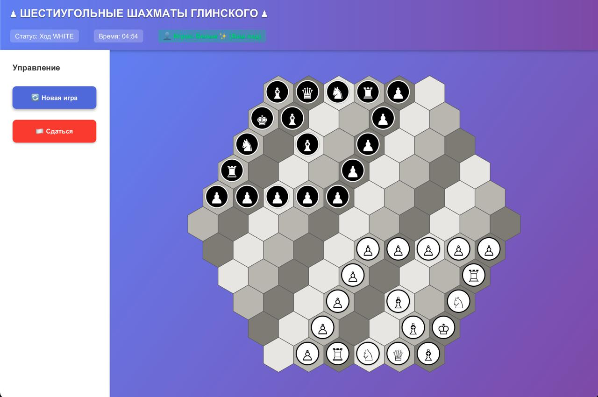

# Шестиугольные шахматы Глинского

Реализация игры в шестиугольные шахматы Глинского на Java с использованием JavaFX.



## Описание

Проект представляет собой реализацию шахмат на шестиугольной доске по правилам Глинского. Игра поддерживает два режима:
- **Интерактивный режим**: игра против бота
- **Режим наблюдения**: автоматическая игра бота против бота

## Правила игры

### Доска
- Шестиугольная доска с радиусом 5 (91 поле)
- Координаты задаются в осевой системе координат (q, r, s)

### Фигуры
- **Пешка** - ходит на одно поле вперед, бьет по диагонали
- **Ладья** - ходит по прямым линиям в 6 направлениях
- **Конь** - ходит буквой "Г" (2+1 или 1+2)
- **Слон** - ходит по диагоналям
- **Ферзь** - ходит как ладья и слон
- **Король** - ходит на одно поле в любом направлении

### Особенности
- Пешка превращается в ферзя при достижении противоположного края доски
- Шах и мат работают аналогично классическим шахматам
- Игрок всегда играет белыми фигурами

## Структура проекта

```
task2-oop-hex-chess/
├── chess-backend/     # Backend модуль (логика игры)
├── chess-ui/          # UI модуль (графический интерфейс)
└── pom.xml            # Родительский POM файл
```

## Требования

- Java 17 или выше
- Maven 3.6+
- JavaFX (включен в зависимости проекта)

## Установка и запуск

### 1. Установите backend модуль:

```bash
cd chess-backend
mvn clean install
```

### 2. Запустите UI приложение:

```bash
cd chess-ui
mvn javafx:run
```

### Альтернативный способ (из корня проекта):

```bash
mvn clean install
cd chess-ui
mvn javafx:run
```

## Запуск игры

Для игры пользователя против бота:

```bash
cd chess-ui
mvn javafx:run
```

## Управление

- **Клик по фигуре** - выбор фигуры для хода
- **Клик по полю** - выполнение хода
- **Повторный клик по выбранной фигуре** - отмена выбора

## Технологии

- **Java 17**
- **JavaFX** - для графического интерфейса
- **Maven** - для управления зависимостями и сборки

## Автор

LostSoulMaks

## Лицензия

Учебный проект

